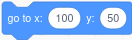

# The ScratchyPy API

API stands for "Application Programming Interface" and it is the documentation
of all the things that ScratchyPy can do.

The complete API generated directly from the code is published on the GitHub
pages site:
* [ScratchyPy API Documentation](https://jtmarkoise.github.io/scratchypy-api-master)

Quick table of contents here:
* [Motion](#motion)
* [Looks](#looks)
* [Sound](#sound)
* [Events](#events)
* [Control](#control)
* [Sensing](#sensing)
* [Operators](#operators)
* [Variables](#variables)
* [My Blocks](#myblocks)

<a name="await"></a>

## What's all this `await` stuff? 
In Scratch, you can create multiple stacks of blocks and they will magically
run at the same time.

In most programming languages, instructions are run one after another in a 
sequence, called a *thread*.  It is possible and common to run two things in
parallel on multiple threads, but that can get complicated and is not
recommended for the beginner programmer.

Additionally, many UI frameworks work off an "event loop" model anyway.  This
has one central "forever" loop that handles events, such as mouse clicks or 
button presses, and pumps them out to custom code to do the special actions.
The most important thing the event loop does is redraw the screen many times
per second.  ScratchyPy uses an event loop model like this.

Some things in the ScratchyPy vocabulary are long-running animations or things
we have to wait for.


If we were to just stop the ScratchyPy code while these things 
happen, the event loop wouldn't run and the program would become unresponsive
 \- clicks wouldn't work and the screen would stop updating.

For these situations, you will see ScratchyPy code like this:

```python
    await sprite1.ask_and_wait("What is your name?")
```

Notice the special `await` before the function call.  In Python, this is a
special word that loosely means "pause this program while its waiting and go 
back to the event loop".  What it is really doing is fairly advanced, even for
experienced programmers, but don't worry.  Just know that any time you see a
function that ends with _wait(), you will be REQUIRED to put the `await` in
front of it.  If you forget, you will see a message in the console reminding 
you.

## The Woefully Incomplete List of Scratch Equivalents

<a name="motion"></a>

### Motion
<table border="1">
<tr><th> Scratch </th><th> ScratchyPy </th></tr>
<!-- ============================================================ -->
<tr><td>


    
</td><td>

```
sprite1.move(10)
```

</td></tr>
<!-- ============================================================ -->
<tr><td>


    
</td><td>

```
sprite1.turn(15)    # clockwise
sprite1.turn(-15)   # counter-clockwise
```

</td></tr>
<!-- ============================================================ -->
<tr><td>


    
</td><td>

```
sprite1.go_to_position(get_window().random_position())
sprite1.go_to_position(get_window().mouse_pointer())
```

</td></tr>
<!-- ============================================================ -->
<tr><td>


    
</td><td>

```
sprite1.go_to(100, 50)
```

</td></tr>
<!-- ============================================================ -->
<tr><td>


    
</td><td>

```
await sprite1.glide_to_position_and_wait(get_window().random_position(), 1)
await sprite1.glide_to_position_and_wait(get_window().mouse_pointer(), 1)
```

The above mimics Scratch's behavior.  ScratchyPy also has a similar function
that starts the glide in the background and continues running code.

```
sprite1.glide_to_position(get_window().random_position(), 5)  # No await
```

</td></tr>
<!-- ============================================================ -->
<tr><td>


    
</td><td>

```
await sprite1.glide_to_and_wait(100, 50, 1)
```

The above mimics Scratch's behavior.  ScratchyPy also has a similar function
that starts the glide in the background and continues running code.

```
sprite1.glide_to(100, 50, 5)  # No await
```

</td></tr>
<!-- ============================================================ -->
<tr><td>


    
</td><td>
Point to the direction in degrees, where 0 is straight up.

```
sprite1.point_in_direction(0)
```

</td></tr>
<!-- ============================================================ -->
<tr><td>


    
</td><td>
Point towards an (x,y) position or another sprite.

```
sprite1.point_towards(get_window().mouse_pointer())
sprite1.point_towards(sprite2)
```

</td></tr>
<!-- ============================================================ -->
<tr><td>


    
</td><td>
The change may be positive or negative

```
sprite1.change_x_by(10)
sprite1.change_y_by(10)
```

</td></tr>
<!-- ============================================================ -->
<tr><td>


    
</td><td>

```
sprite1.set_x_to(79)
sprite1.set_y_to(-44)
```

Negative values will go off the screen.

</td></tr>
<!-- ============================================================ -->
<tr><td>


    
</td><td>
The change may be positive or negative

```
sprite1.change_x_by(10)
sprite1.change_y_by(10)
```

</td></tr>
<!-- ============================================================ -->
<tr><td>


    
</td><td>

```
sprite1.if_on_edge_bounce()
```

</td></tr>
<!-- ============================================================ -->
<tr><td>


    
</td><td>

```
sprite1.set_rotation_style(DONT_ROTATE)
sprite1.set_rotation_style(LEFT_RIGHT)
sprite1.set_rotation_style(ALL_AROUND)
```

</td></tr>
<!-- ============================================================ -->
<tr><td>


    
</td><td>

```
myvar = sprite1.x_position
myvar = sprite1.y_position
myvar = sprite1.direction
```

Note that these are properties and do not require () like function calls.

</td></tr>
</table>

<a name="looks"></a>

### Looks

<table border="1">
<tr><th> Scratch </th><th> ScratchyPy </th></tr>
<!-- ============================================================ -->
<tr><td>


</td><td>

```
await sprite1.say_and_wait("Hello!", 2)
await sprite1.think_and_wait("Hmm...", 2)
```

These will [await](#await) until the time is up.

</td></tr>
<!-- ============================================================ -->
<tr><td>


    
</td><td>

```
await sprite1.say("Hello!")
await sprite1.think("Hmm...")
```

These will display the bubble and continue the program.

</td></tr>
<!-- ============================================================ -->
<tr><td>


    
</td><td>

Multiple costumes can be specified when creating the Sprite.  Then the costumes 
can be switched by telling the number here.  Remember in Python, things start 
counting with zero!

```
sprite1 = Sprite(["costume0.png", "costume1.png", "costume2.png"])
sprite1.switch_costume_to(2)  # picks "costume2.png"
```

</td></tr>

<!-- ============================================================ -->
<tr><td>


    
</td><td>

```
sprite1 = Sprite(["costume0.png", "costume1.png", "costume2.png"])
sprite1.next_costume()
```

</td></tr>
<!-- ============================================================ -->
<tr><td>


    
</td><td>

The backdrop is for the background of the Stage so it is on the Stage object.

```
stage.add_backdrop("background0.png")
stage.add_backdrop("background1.png", "desert")
stage.switch_backdrop_to(0)         # by index
stage.switch_backdrop_to("desert")   # or by name
```

</td></tr>
<!-- ============================================================ -->
<tr><td>


    
</td><td>

NOT IMPLEMENTED

</td></tr>
<!-- ============================================================ -->
<tr><td>


    
</td><td>

```
stage.next_backdrop()
```

Bonus! There is also

```
stage.previous_backdrop()
stage.random_backdrop()
```

</td></tr>
<!-- ============================================================ -->
<tr><td>


    
</td><td>

This makes the sprite 50% bigger.

```
sprite1.change_size_by(50)
```

</td></tr>
<!-- ============================================================ -->
<tr><td>


    
</td><td>

This sets the sprite back to 100% size (original size)

```
sprite1.set_size_to(100)
```

</td></tr>

</table>

    
<a name="sound"></a>

### Sound

<a name="events"></a>

### Events

<a name="control"></a>

### Control
Things related to control are mostly part of the Python language itself.
These blocks are still covered here for completeness and to point out some
important caveats.

<table border="1">
<tr><th> Scratch </th><th> ScratchyPy </th></tr>
<!-- ============================================================ -->
<tr><td>


    
</td><td>

`await wait(1)`
   
Note: do NOT use Python's `time.sleep(1)` as that will block the event loop!
See [the await section](#await) for more detail.

</td></tr>
<!-- ============================================================ -->
<tr><td>


</td><td>

```
for i in range(10):
    doSomething()
```

</td></tr>
<!-- ============================================================ -->
<tr><td>


</td><td>

```
def runEachTick():
    doSomething()
sprite1.forever(runEachTick)
```

Note: Do NOT use `while True: doSomething()` as that will block the event loop!
See [the await section](#await) for more detail.

</td></tr>
<!-- ============================================================ -->
<tr><td>


</td><td>

```
if myvar < 10:
    doSomething()
```

</td></tr>
<!-- ============================================================ -->
<tr><td>


</td><td>

```
if myvar < 10:
    doSomething()
else:
    doSomethingElse()
```

</td></tr>
<!-- ============================================================ -->
<tr><td>


</td><td>
The Python equivalent is inverted to mean "wait while" the opposite condition.

```
async def doSomething():
    while myval >= 10:
        await get_window().next_frame()
```

This checks if myval >= 10, and while so, waits for the next frame to check
again.
Because [we can't sit here waiting](#await), we must use the `await` keyword
and put this code in an `async` function.

</td></tr>
<!-- ============================================================ -->
<tr><td>


</td><td>
The Python equivalent is inverted to mean "repeat while" the opposite condition.

```
while myval >= 10:
    doSomething()
```

Careful if your doSomething() takes a long time or has to wait.  You can also 
make this use `await` like the previous example if so.

</td></tr>
<!-- ============================================================ -->
<tr><td>


</td><td>
It depends what you want to do here.  If you want to stop just the current 
function, then you can do this:

```
def doSomething():
    for item in myCart:
        if item == "apple":
            return item  # stop searching once we find the apple
```

</td></tr>
<!-- ============================================================ -->
<tr><td>


</td><td>
TODO

</td></tr>
<!-- ============================================================ -->
<tr><td>


</td><td>

```
sprite2 = sprite1.clone()
sprite3 = sprite2.clone("clone's name", stage) # name it special and add to stage too
```

</td></tr>
<!-- ============================================================ -->
<tr><td>


</td><td>
TODO

</td></tr>
</table>

<a name="sensing"></a>

### Sensing

<a name="operators"></a>

### Operators

<a name="variables"></a>

### Variables

<a name="myblocks"></a>

### My Blocks

