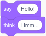
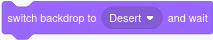
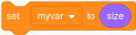
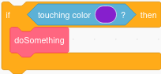
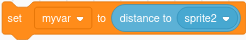

# The ScratchyPy API

API stands for "Application Programming Interface" and it is the documentation
of all the things that ScratchyPy can do.

The complete API generated directly from the code is published on the GitHub
pages site:
* [ScratchyPy API Documentation](https://jtmarkoise.github.io/scratchypy-api-master)

Quick table of contents here:
* [Motion](#motion)
* [Looks](#looks)
* [Sound](#sound)
* [Events](#events)
* [Control](#control)
* [Sensing](#sensing)
* [Operators](#operators)
* [Variables](#variables)
* [My Blocks](#myblocks)

## Bananas or not?

By bananas, we mean the parentheses () used in Python to call a function. 
Functions *DO* things, and in Scratch, the blocks that do things are rounded 
rectangles.


So, if what you want is a rectangle in Scratch, then it is 
probably a function call in ScratchyPy, and you shouldn't forget the bananas! 
There may even be *arguments* (called "inputs" in Scratch) to the function 
call.  See the documentation for the function to see what is needed to be 
provided.

```
sprite1.move(10)   # Bananas!  With an argument of how many pixels to move.
```

Things that are ovals in Scratch are *values* such as variables or


In ScratchyPy, these are _properties_ of an object and do not need bananas to 
get the value.

```
myvar = get_window().timer  # No bananas!
```

> [!NOTE]
> For the most part this convention is followed, but there are exceptions!

<a name="await"></a>

## What's all this `await` stuff? 
In Scratch, you can create multiple stacks of blocks and they will magically
run at the same time.

In most programming languages, instructions are run one after another in a 
sequence, called a *thread*.  It is possible and common to run two things in
parallel on multiple threads, but that can get complicated and is not
recommended for the beginner programmer.

Additionally, many UI frameworks work off an "event loop" model anyway.  This
has one central "forever" loop that handles events, such as mouse clicks or 
button presses, and pumps them out to custom code to do the special actions.
The most important thing the event loop does is redraw the screen many times
per second.  ScratchyPy uses an event loop model like this.

Some things in the ScratchyPy vocabulary are long-running animations or things
we have to wait for.


If we were to just stop the ScratchyPy code while these things 
happen, the event loop wouldn't run and the program would become unresponsive
 \- clicks wouldn't work and the screen would stop updating.

For these situations, you will see ScratchyPy code like this:

```python
    await sprite1.ask_and_wait("What is your name?")
```

Notice the special `await` before the function call.  In Python, this is a
special word that loosely means "pause this program while its waiting and go 
back to the event loop".  What it is really doing is fairly advanced, even for
experienced programmers, but don't worry.  Just know that any time you see a
function that ends with _wait(), you will be REQUIRED to put the `await` in
front of it.  If you forget, you will see a message in the console reminding 
you.

## The Woefully Incomplete List of Scratch Equivalents

<a name="motion"></a>

### Motion
<table border="1">
<tr><th>__________Scratch____________</th>
    <th>_________ScratchyPy__________</th></tr>
<!-- ============================================================ -->
<tr><td>


    
</td><td>

```python
sprite1.move(10)
```

</td></tr>
<!-- ============================================================ -->
<tr><td>


    
</td><td>

```python
sprite1.turn(15)    # clockwise
sprite1.turn(-15)   # counter-clockwise
```

</td></tr>
<!-- ============================================================ -->
<tr><td>


    
</td><td>

```python
sprite1.go_to_position(get_window().random_position())
sprite1.go_to_position(get_window().mouse_pointer())
```

</td></tr>
<!-- ============================================================ -->
<tr><td>


    
</td><td>

```python
sprite1.go_to(100, 50)
```

</td></tr>
<!-- ============================================================ -->
<tr><td>


    
</td><td>

```python
await sprite1.glide_to_position_and_wait(get_window().random_position(), 1)
await sprite1.glide_to_position_and_wait(get_window().mouse_pointer(), 1)
```

The above mimics Scratch's behavior.  ScratchyPy also has a similar function
that starts the glide in the background and continues running code.

```python
sprite1.glide_to_position(get_window().random_position(), 5)  # No await
```

</td></tr>
<!-- ============================================================ -->
<tr><td>


    
</td><td>

```python
await sprite1.glide_to_and_wait(100, 50, 1)
```

The above mimics Scratch's behavior.  ScratchyPy also has a similar function
that starts the glide in the background and continues running code.

```python
sprite1.glide_to(100, 50, 5)  # No await
```

</td></tr>
<!-- ============================================================ -->
<tr><td>


    
</td><td>
Point to the direction in degrees, where 0 is straight up.

```python
sprite1.point_in_direction(0)
```

</td></tr>
<!-- ============================================================ -->
<tr><td>


    
</td><td>
Point towards an (x,y) position or another sprite.

```python
sprite1.point_towards(get_window().mouse_pointer())
sprite1.point_towards(sprite2)
```

</td></tr>
<!-- ============================================================ -->
<tr><td>


    
</td><td>
The change may be positive or negative

```python
sprite1.change_x_by(10)
sprite1.change_y_by(10)
```

</td></tr>
<!-- ============================================================ -->
<tr><td>


    
</td><td>

```python
sprite1.set_x_to(79)
sprite1.set_y_to(-44)
```

Negative values will go off the screen.

</td></tr>
<!-- ============================================================ -->
<tr><td>


    
</td><td>
The change may be positive or negative

```python
sprite1.change_x_by(10)
sprite1.change_y_by(10)
```

</td></tr>
<!-- ============================================================ -->
<tr><td>


    
</td><td>

```python
sprite1.if_on_edge_bounce()
```

</td></tr>
<!-- ============================================================ -->
<tr><td>


    
</td><td>

```python
sprite1.set_rotation_style(DONT_ROTATE)
sprite1.set_rotation_style(LEFT_RIGHT)
sprite1.set_rotation_style(ALL_AROUND)
```

</td></tr>
<!-- ============================================================ -->
<tr><td>


    
</td><td>

```python
myvar = sprite1.x_position
myvar = sprite1.y_position
myvar = sprite1.direction
```

Note that these are properties and do not require () like function calls.

</td></tr>
</table>

<a name="looks"></a>

### Looks

<table border="1">
<tr><th>__________Scratch____________</th>
    <th>_________ScratchyPy__________</th></tr>
<!-- ============================================================ -->
<tr><td>


</td><td>

```python
await sprite1.say_and_wait("Hello!", 2)
await sprite1.think_and_wait("Hmm...", 2)
```

These will [await](#await) until the time is up.

</td></tr>
<!-- ============================================================ -->
<tr><td>


    
</td><td>

```python
await sprite1.say("Hello!")
await sprite1.think("Hmm...")
```

These will display the bubble and continue the program.

</td></tr>
<!-- ============================================================ -->
<tr><td>


    
</td><td>

Multiple costumes can be specified when creating the Sprite.  Then the costumes 
can be switched by telling the number here.  Remember in Python, things start 
counting with zero!

```python
sprite1 = Sprite(["costume0.png", "costume1.png", "costume2.png"])
sprite1.switch_costume_to(2)  # picks "costume2.png"
```

</td></tr>

<!-- ============================================================ -->
<tr><td>


    
</td><td>

```python
sprite1 = Sprite(["costume0.png", "costume1.png", "costume2.png"])
sprite1.next_costume()
```

</td></tr>
<!-- ============================================================ -->
<tr><td>


    
</td><td>

The backdrop is for the background of the Stage so it is on the Stage object.

```python
stage.add_backdrop("background0.png")
stage.add_backdrop("background1.png", "desert")
stage.switch_backdrop_to(0)         # by index
stage.switch_backdrop_to("desert")   # or by name
```

</td></tr>
<!-- ============================================================ -->
<tr><td>


    
</td><td>

NOT IMPLEMENTED

</td></tr>
<!-- ============================================================ -->
<tr><td>


    
</td><td>

```python
stage.next_backdrop()
```

Bonus! There is also

```python
stage.previous_backdrop()
stage.random_backdrop()
```

</td></tr>
<!-- ============================================================ -->
<tr><td>


    
</td><td>

This makes the sprite 50% bigger.

```python
sprite1.change_size_by(50)
```

</td></tr>
<!-- ============================================================ -->
<tr><td>


    
</td><td>

This sets the sprite back to 100% size (original size)

```python
sprite1.set_size_to(100)
```

</td></tr>
<!-- ============================================================ -->
<tr><td>


    
</td><td>

NOT IMPLEMENTED

</td></tr>

<!-- ============================================================ -->
<tr><td>


    
</td><td>

```python
sprite1.show()
```

</td></tr>
<!-- ============================================================ -->
<tr><td>


    
</td><td>

```python
sprite1.hide()
```

</td></tr>
<!-- ============================================================ -->
<tr><td>


    
</td><td>

NOT IMPLEMENTED YET

</td></tr>
<!-- ============================================================ -->
<tr><td>


    
</td><td>

NOT IMPLEMENTED YET

</td></tr>
<!-- ============================================================ -->
<tr><td>


    
</td><td>

```python
myvar = sprite1.costume_number
myvar = sprite1.costume_name  ## NOT IMPLEMENTED YET
```

</td></tr>
<!-- ============================================================ -->
<tr><td>


    
</td><td>

This is as a percent.  For width and height, see sprite1.rect().

```python
myvar = sprite1.size
```

</td></tr>

</table>

<!-- @@@@@@@@@@@@@@@@@@@@@@@@ SOUND @@@@@@@@@@@@@@@@@@@@@@@@ -->
<a name="sound"></a>

### Sound

Sorry, sound is NOT IMPLEMENTED yet!

<!-- @@@@@@@@@@@@@@@@@@@@@@@@ EVENTS @@@@@@@@@@@@@@@@@@@@@@@@@@@@@@@@@@ -->
<a name="events"></a>

### Events

Events are all set as _callbacks_ to functions that you write.  Usually the 
callbacks are set with functions that start with _when_, and you give it the 
name of your function _without_ the bananas),  Your function will be called 
with an argument of the object that had the event on it.

<table border="1">
<tr><th>__________Scratch____________</th>
    <th>_________ScratchyPy__________</th></tr>
<!-- ============================================================ -->
<tr><td>


    
</td><td>

Unlike the scratch blocks, this can only be done once to start the program.  
Make a single function to do everything needed to start your program and draw 
the initial stage.  The function takes an argument which is the stage to add 
your sprites to.

```python
def doTheStartupStuff(stage)
    sprite1 = Sprite("character.png")
    stage.add(sprite1)
start(doTheStartupStuff)  # Like the green flag.  Note no bananas ()
```

</td></tr>
<!-- ============================================================ -->
<tr><td>


    
</td><td>

```python
def moveUpSprite(theSprite):
    theSprite.change_y_by(-10)
sprite1.when_key_pressed("up", moveUpSprite)

def changeBackground(theStage):
    theStage.next_backdrop()
stage.when_key_pressed("b", changeBackground)
```

The names of most keys on the keyboard can be passed as the first argument to 
this function.  Special keys have friendly names, like "up" above.  You can also 
use pygame key codes such as `pygame.K_ESACPE`.  See 
[Pygame's list](https://www.pygame.org/docs/ref/key.html) for the complete set 
of key codes and special strings.

Key events can be added to sprites as well as stages.

</td></tr>
<!-- ============================================================ -->
<tr><td>


    
</td><td>

```python
def doALittleDance(sprite)
    sprite.turn(15)
sprite.when_clicked(doALittleDance)

def changeBackground(theStage):
    theStage.next_backdrop()
stage.when_clicked(changeBackground)
```

A click handler can be set on each sprite as well as each stage.

</td></tr>
<!-- ============================================================ -->
<tr><td>


    
</td><td>

NOT IMPLEMENTED

</td></tr>
<!-- ============================================================ -->
<tr><td>


    
</td><td>

```python
def gotAMessage(sprite, arguments):
    sprite.say("Hello " + arguments["name"])
sprite.when_i_receive("message1", gotAMessage)
```

As a bonus, ScratchyPy lets you add additional arguments to your broadcast 
messages.  See below for how to use them.

</td></tr>
<!-- ============================================================ -->
<tr><td>


    
</td><td>

Broadcasts, since they go to all sprites, can currently only be done from the
stage object.

```python
stage.broadcast("hello")
```

Optionally, you can add additional information to the broadcast as a Python 
dictionary:

```python
stage.broadcast("hello", {name:"Axel"})
```

</td></tr>
<!-- ============================================================ -->
<tr><td>


    
</td><td>

Unclear how to handle this block.  The when_i_receive function will run in the 
same tick as the broadcast() call.  If that callback is a regular function,
then it will run to completion before the broadcast() returns.  If the callback
is an async function, then it will run in the background and there is not a 
good way to wait for it to complete.

> [!CAUTION]
> I may decide to change how this works.

</td></tr>

</table>

<!-- @@@@@@@@@@@@@@@@@@@@@@@@ CONTROL @@@@@@@@@@@@@@@@@@@@@@@@@@@@@@@@@@ -->
<a name="control"></a>

### Control
Things related to control are mostly part of the Python language itself.
These blocks are still covered here for completeness and to point out some
important caveats.

<table border="1">
<tr><th>__________Scratch____________</th>
    <th>_________ScratchyPy__________</th></tr>
<!-- ============================================================ -->
<tr><td>


    
</td><td>

```python
await wait(1)
```
   
Note: do NOT use Python's `time.sleep(1)` as that will block the event loop!
See [the await section](#await) for more detail.

</td></tr>
<!-- ============================================================ -->
<tr><td>


</td><td>

```python
for i in range(10):
    doSomething()
```

</td></tr>
<!-- ============================================================ -->
<tr><td>


</td><td>

```python
def runEachTick():
    doSomething()
sprite1.forever(runEachTick)
```

Note: Do NOT use `while True: doSomething()` as that will block the event loop!
See [the await section](#await) for more detail.

</td></tr>
<!-- ============================================================ -->
<tr><td>


</td><td>

```python
if myvar < 10:
    doSomething()
```

</td></tr>
<!-- ============================================================ -->
<tr><td>


</td><td>

```python
if myvar < 10:
    doSomething()
else:
    doSomethingElse()
```

</td></tr>
<!-- ============================================================ -->
<tr><td>


</td><td>
The Python equivalent is inverted to mean "wait while" the opposite condition.

```python
async def doSomething():
    while myval >= 10:
        await get_window().next_frame()
```

This checks if myval >= 10, and while so, waits for the next frame to check
again.
Because [we can't sit here waiting](#await), we must use the `await` keyword
and put this code in an `async` function.

</td></tr>
<!-- ============================================================ -->
<tr><td>


</td><td>
The Python equivalent is inverted to mean "repeat while" the opposite condition.

```python
while myval >= 10:
    doSomething()
```

Careful if your doSomething() takes a long time or has to wait.  You can also 
make this use `await` like the previous example if so.

</td></tr>
<!-- ============================================================ -->
<tr><td>


</td><td>
It depends what you want to do here.  If you want to stop just the current 
function, then you can do this:

```python
def doSomething():
    for item in myCart:
        if item == "apple":
            return item  # stop searching once we find the apple
```

</td></tr>
<!-- ============================================================ -->
<tr><td>


</td><td>
NOT IMPLEMENTED

</td></tr>
<!-- ============================================================ -->
<tr><td>


</td><td>

```python
sprite2 = sprite1.clone()

## This extended form gives the clone a new name and adds it to stage
sprite3 = sprite2.clone("clone's name", stage)
```

</td></tr>
<!-- ============================================================ -->
<tr><td>


</td><td>
TODO

</td></tr>
</table>

<!-- @@@@@@@@@@@@@@@@@@@@@@@@@@@@@@@ SENSING @@@@@@@@@@@@@@@@@@@@@@@@@@@@ -->

<a name="sensing"></a>

### Sensing

<table border="1">
<tr><th>__________Scratch____________</th>
    <th>_________ScratchyPy__________</th></tr>
<!-- ============================================================ -->
<tr><td>


</td><td>

```python
if sprite1.touching(get_window().mouse_pointer):
    doSomething()
```

</td></tr>
<!-- ============================================================ -->
<tr><td>


</td><td>

```python
if sprite1.touching_edge():
    doSomething()
```

Note an alternative form is `sprite1.touching(Sprite.EDGE)`.

</td></tr>
<!-- ============================================================ -->
<tr><td>


</td><td>

```python
if sprite1.touching(sprite2):
    doSomething()
```

</td></tr>
<!-- ============================================================ -->
<tr><td>



</td><td>

```python
if sprite1.touching_color(color.PURPLE):
    doSomething()
```

`color` is a module within scratchypy with named colors.  It can also be used 
as `scratchypy.color.PURPLE`.

</td></tr>
<!-- ============================================================ -->
<tr><td>


</td><td>

NOT IMPLEMENTED

</td></tr>
<!-- ============================================================ -->
<tr><td>


</td><td>

```python
myvar = sprite1.distance_to(get_window().mouse_pointer)
```

</td></tr>
<!-- ============================================================ -->
<tr><td>



</td><td>

```python
myvar = sprite1.distance_to(sprite2)
```

</td></tr>
<!-- ============================================================ -->
<tr><td>


</td><td>

```python
answer = await sprite1.ask_and_wait("What's your name?")
```

`answer` is just a variable name and can be anything you want.

</td></tr>
<!-- ============================================================ -->
<tr><td>


</td><td>

```python
if get_window().key_pressed("space"):
    doSomething()
```

You can also use `get_window.key_pressed('any')` for checking any key.
</p>
See also `sprite1.when_key_pressed()` for more efficient key handling.


</td></tr>
<!-- ============================================================ -->
<tr><td>


</td><td>

```python
if get_window().mouse_down():
    doSomething()
```

</td></tr>
<!-- ============================================================ -->
<tr><td>


</td><td>

```python
myvar = get_window().mouse_x
myvar2 = get_window().mouse_y
```

</td></tr>
<!-- ============================================================ -->
<tr><td>


</td><td>

NOT IMPLEMENTED

</td></tr>
<!-- ============================================================ -->
<tr><td>


</td><td>

NOT IMPLEMENTED

</td></tr>
<!-- ============================================================ -->
<tr><td>


</td><td>


```python
myvar = get_window().timer
```

Like Scratch, this gives the number of seconds since the program started. 
There are also many different timing functions in Python's `time` module.

</td></tr>
<!-- ============================================================ -->
<tr><td>


</td><td>

```python
get_window().reset_timer() 
```

</td></tr>
<!-- ============================================================ -->
<tr><td>


</td><td>

This is to get a property from a different object.  This is easy in Python if 
you have the variable for the other object.  For example, to match the X 
position of two sprites:

```python
sprite1.set_x_to(sprite2.x_position)
```

</td></tr>
<!-- ============================================================ -->
<tr><td>


</td><td>

Gets the year or other parts of the date or time.  This is readily available 
in Python's `datetime` module and I didn't think it was worth re-implementing.

```python
import datetime
now = datetime.datetime.now()
currentYear = now.year
currentMonth = now.month
currentDate = now.day
currentDayOfWeek = now.weekday()  # Bananas! Monday=0 ... Sunday=6
currentHour = now.hour
currentMinute = now.minute
currentSecond = now.second
```

</td></tr>

<!-- ============================================================ -->
<tr><td>


</td><td>

This can also be done in `datetime` but is implemented in ScratchyPy for 
convenience in the `util` module.

```python
myvar = days_since_2000()  # Bananas exception!
```

This gives fractional days since 1/1/2000.  Note that Scratch online seems to 
give UTC days but this will give days in your local time.

</td></tr>
<!-- ============================================================ -->
<tr><td>


</td><td>

This will give the username of the account logged into the computer.

```python
myvar = username()  # Bananas exception!
```

</td></tr>

</table>


<!-- @@@@@@@@@@@@@@@@@@@@@@@ OPERATORS  @@@@@@@@@@@@@@@@@@@@@@@@@ -->

<a name="operators"></a>

### Operators

Everything in this section is built into Python.

<table border="1">
<tr><th>__________Scratch____________</th>
    <th>_________ScratchyPy__________</th></tr>

<!-- ============================================================ -->
<tr><td>


</td><td>

```python
myvar = 6 + 4
myvar2 = 6 - 4
myvar3 = 6 * 4
myvar4 = 6 / 4
myvar5 = 6 % 4
```

</td></tr>
<!-- ============================================================ -->
<tr><td>


</td><td>

```python
import random
myvar = random.randint(1,10)
```

</td></tr>
<!-- ============================================================ -->
<tr><td>


</td><td>

```python
if myvar > 50:
    doSomething()
if myvar < 50:
    doSomething()
if myvar == 50:     # Note double equal sign!
    doSomething()
```

</td></tr>
<!-- ============================================================ -->
<tr><td>


</td><td>

```python
if myvar > 50 and myvar < 100:
    doSomething()
if myvar == 50 or myvar2 == 50:
    doSomething()
if not myvar == 0:    # or `myvar != 0`
    doSomething()
```

</td></tr>
<!-- ============================================================ -->
<tr><td>


</td><td>

```python
myvar = "apple" + "banana"
myvar2 = "apple"[0]   # Remember index 0 is the first letter!
myvar3 = len("apple")
if "a" in "apple":
    doSomething()
```

</td></tr>
<!-- ============================================================ -->
<tr><td>


</td><td>

```python
myvar = round(3.14)
```

</td></tr>
<!-- ============================================================ -->
<tr><td>

Lots of other math operations:


</td><td>

```python
import math
myvar = math.sqrt(3.14)
myvar = abs(-3)
myvar = math.floor(3.14)
myvar = math.ceil(3.14)
# and many more...
```

</td></tr>

</table>

<!-- @@@@@@@@@@@@@@@@@@@@@@@@@@@@ VARIABLES @@@@@@@@@@@@@@@@@@@ -->

<a name="variables"></a>

### Variables

Variables you have seen a lot already above.

<table border="1">
<tr><th>__________Scratch____________</th>
    <th>_________ScratchyPy__________</th></tr>
<!-- ============================================================ -->
<tr><td>


</td><td>

```python
myvar = 7
myvar += 1
```

</td></tr>
<!-- ============================================================ -->
<tr><td>


</td><td>

Not implemented on-screen, but you can easily see the value of a variable on the console 
anytime with `print(myvar)`.

</td></tr>

</table>

<!-- @@@@@@@@@@@@@@@@@@@@@@@@@@@@ VARIABLES @@@@@@@@@@@@@@@@@@@ -->

<a name="myblocks"></a>

### My Blocks

These you have also seen plenty of already... they are just functions and 
defined similarly in Python.

<table border="1">
<tr><th>__________Scratch____________</th>
    <th>_________ScratchyPy__________</th></tr>
<!-- ============================================================ -->
<tr><td>


</td><td>

```
def myFunction(myNumberOrText, myBoolean):
    # stuff here
    
myFunction(99, True)
```

</td></tr>

</table>
